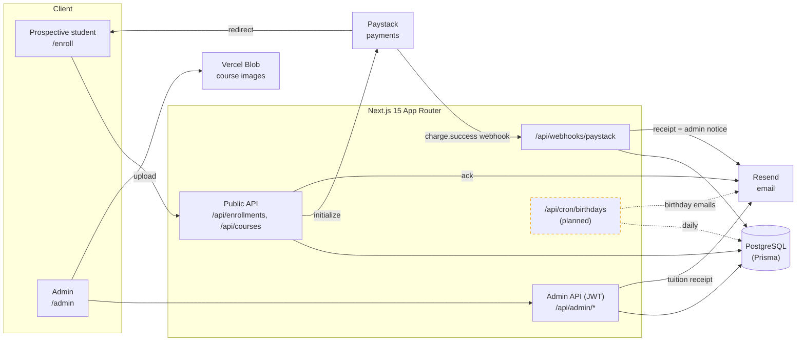
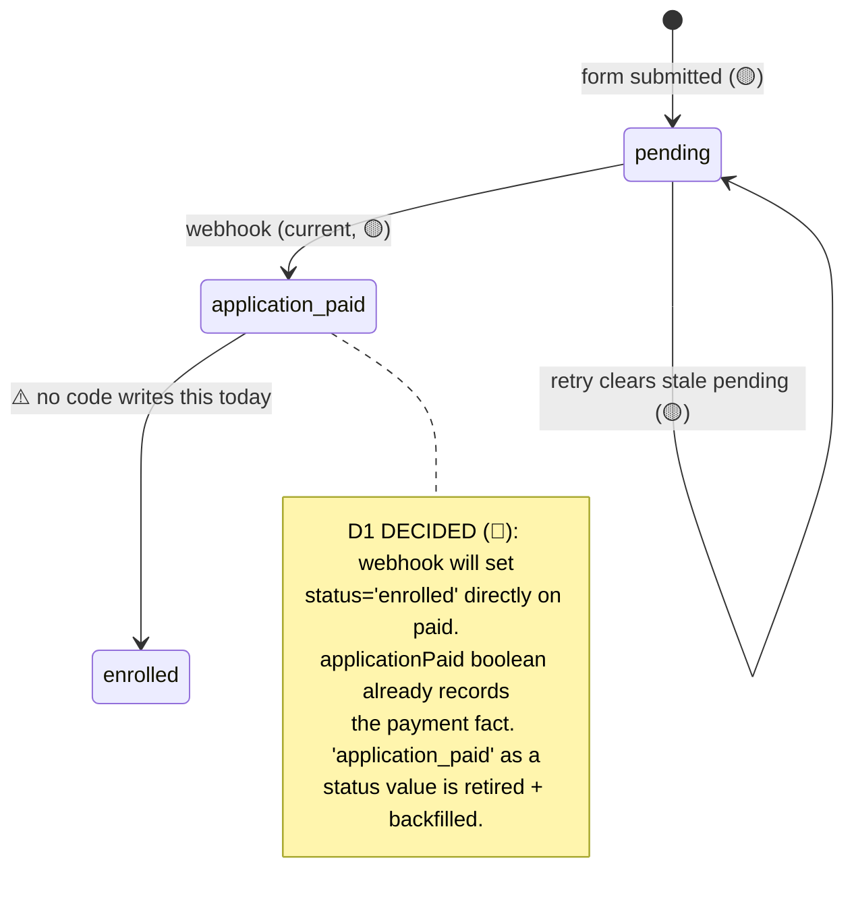
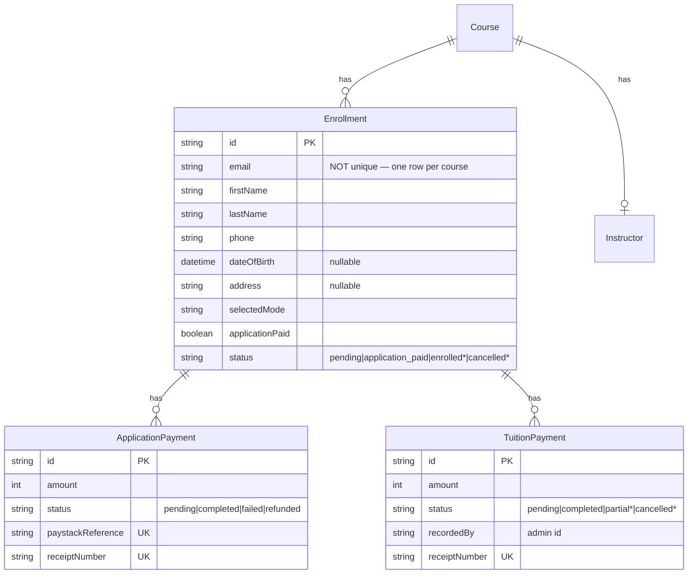
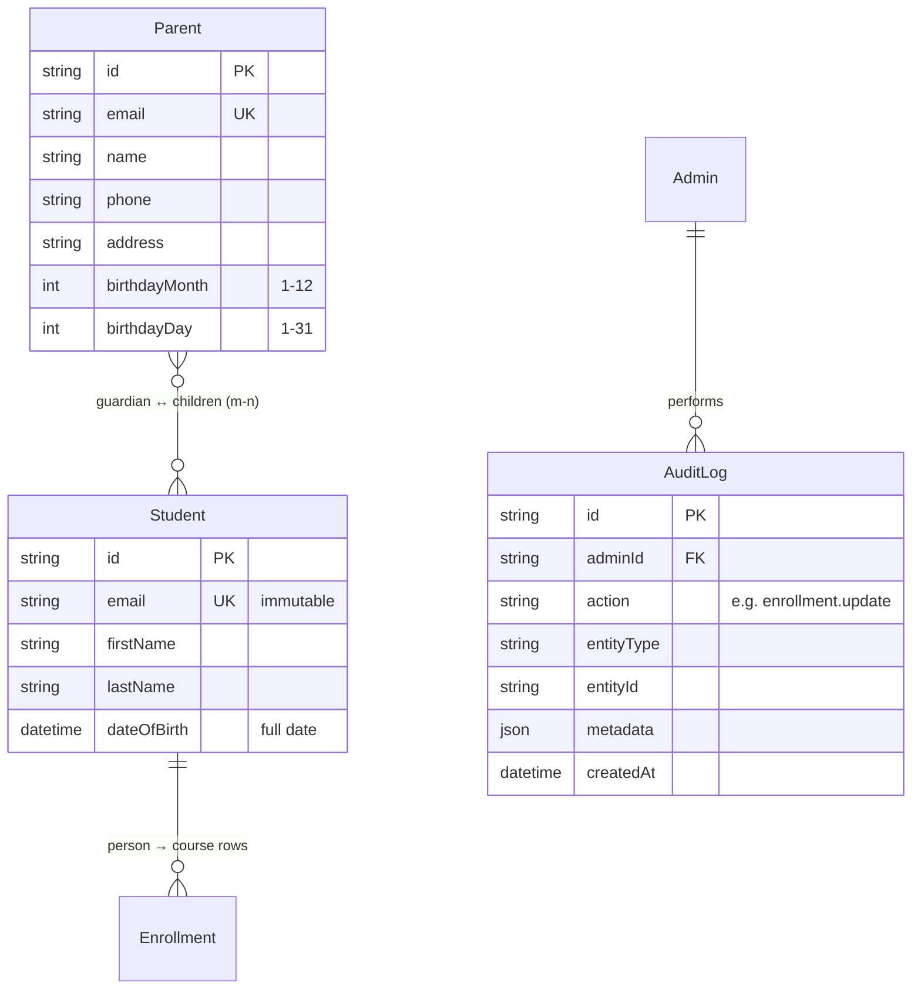

# Banafix — System Blueprint

> **The one document a developer, a designer, and a stakeholder can argue from with the same facts.**
> Every claim is marked with its source so you know how much to trust it.

| Marker | Means | Source |
| --- | --- | --- |
| 🟢 LIVE | Observed on a running system | captured response, real log, DB query |
| 🟡 CODE | Read from source | controller, Prisma schema, enum |
| 🔵 INTENT | Planned, not built | this conversation's requirements |
| ⚠️ UNVERIFIED | Could not be checked | reason stated inline |

- **Mode:** `sync` (current flow re-derived from source) + `init` (the 4 planned additions, all 🔵 INTENT)
- **Date:** 2026-08-31 · **Branch:** `banafix` @ `2a7d192` · **Stack:** Next.js 15 (App Router) · Prisma/Postgres · Paystack · Resend · Vercel Blob

---

## 1. Status snapshot

| Area | State | Notes |
| --- | --- | --- |
| Course browsing + enrollment form | 🟢 Live | `/enroll`, course APIs |
| Application-fee payment (Paystack) | 🟡 Code | init → redirect → webhook verify; webhook signature path proven 🟢 |
| Enrollment status → `application_paid` | 🟡 Code | set by webhook on verified `charge.success` |
| Enrollment status → `enrolled` | 🔵 **Decided (D1)** | today no code writes it; fix = webhook sets `enrolled` on paid — see §4, Drift §9 |
| Student "application received" ack email | 🟡 Code | `POST /api/enrollments` |
| Student paid-receipt + PDF (application fee) | 🟡 Code | webhook |
| Admin "new paid enrollment" notice | 🟡 Code | webhook → `ADMIN_EMAIL`/`SUPPORT_EMAIL` |
| **Email delivery (all of the above)** | ⚠️ **Blocked** | `RESEND_API_KEY` is a placeholder (401); `banafix.com` sender domain unverified |
| Tuition payment (admin-recorded) + student receipt | 🟡 Code | `POST /api/admin/enrollments/[id]/tuition` |
| Tuition: admin copy of receipt | ❌ Not built | **Planned — req #1** |
| Tuition: full/part marking + balance | ❌ Not built | status hardcoded `completed`; balance never computed — **Planned — req #1** |
| Edit student record (admin) | ❌ Not built | no `PATCH` endpoint exists — **Planned — req #2** |
| Parent records + parent↔child mapping | ❌ Not built | no `Parent` model — **Planned — req #3** |
| Birthday automation (students + parents) | ❌ Not built | no scheduler/cron in repo — **Planned — req #4** |
| Admin activity/audit log | ❌ Not built | no model, no logger — **Planned — NB** |

---

## 2. System map 🟡



---

## 3. End-to-end workflow — enrollment → payment → follow-up 🟡

```mermaid
sequenceDiagram
    actor S as Student
    participant FE as /enroll (browser)
    participant API as POST /api/enrollments
    participant PS as Paystack
    participant WH as Webhook
    participant DB as Postgres
    participant M as Resend
    actor A as Admin

    S->>FE: Fill enrollment form
    FE->>API: submit (courseId, mode, student info)
    API->>DB: create Enrollment (status=pending)
    API->>DB: create ApplicationPayment (pending)
    API->>PS: initialize (location-based fee)
    API->>M: "application received" ack (best-effort)
    API-->>FE: authorization_url
    FE->>PS: redirect to checkout
    S->>PS: pay (card/bank/ussd/transfer)

    par Redirect (cosmetic only)
      PS-->>FE: /enroll/success?reference=…
      FE->>API: GET /api/enrollments/verify
      API-->>FE: status (reads DB / asks Paystack)
    and Webhook (authoritative)
      PS->>WH: charge.success
      WH->>PS: verify(reference)
      WH->>DB: ApplicationPayment=completed;<br/>Enrollment=application_paid; seatsLeft--
      WH->>M: student receipt + PDF
      WH->>M: admin "new paid enrollment" notice
    end

    Note over A,DB: MANUAL from here on ⬇
    A->>DB: record tuition payment → student receipt
    Note over A,DB: status never becomes "enrolled" (no code path)
```

**The critical design rule 🟡:** money and state changes happen **only** in the webhook. The `/enroll/success` redirect is UX-only — it *reads* status, never *writes* it. This makes a closed Paystack tab harmless and makes replayed webhooks safe (an already-`completed` payment early-returns — idempotent).

---

## 4. Enrollment status state machine

**Current (🟡) — with the D1 fix marked 🔵:**



> **Decision D1 (resolved):** paying the registration fee **is** enrollment — no approval gate. The webhook will set `status = 'enrolled'` (and `applicationPaid = true`); the redundant `application_paid` status value is retired and existing rows backfilled to `enrolled`. `cancelled` remains available but is out of scope until a cancel action exists. The registration fee is **non-refundable** (some students may never start) — tracked as a note, not a status; tracking "actually started lessons" is a possible future flag, not part of this.

---

## 5. Data model

### 5.1 Current (relevant tables) 🟡



**Field traps 🟡**
- `Enrollment.email` is **not unique** — a person enrolling in two courses is **two rows**. There is no `Student`/person entity. This is the crux of the parent-mapping and birthday decisions (§8, D2).
- `TuitionPayment.status` allows `partial`, and `TuitionReceiptData` already carries an optional `remainingBalance`, but the route **hardcodes `completed`** and never sets a balance. The capability is modelled, not wired.
- No field anywhere stores the **expected total tuition** — so "balance remaining" has no current source of truth (§8, D3).

### 5.2 Planned additions 🔵 (proposed — subject to §8 decisions)



> The `Student` entity is the **recommended** normalization (D2, option A). If we keep the lighter model, `Parent` links directly to `Enrollment` and birthdays dedupe by email instead.

---

## 6. Endpoint index

| Method | Path | Auth | Purpose | Prov |
| --- | --- | --- | --- | --- |
| POST | `/api/enrollments` | public | Create enrollment + init payment + ack email | 🟡 |
| GET | `/api/enrollments` | public* | List enrollments (admin page uses it) | 🟡 |
| GET | `/api/enrollments/[id]` | public* | Enrollment detail | 🟡 |
| GET | `/api/enrollments/verify` | public | Confirm payment for success page | 🟡 |
| POST | `/api/webhooks/paystack` | signature | `charge.success` → paid state + emails | 🟢 sig / 🟡 rest |
| POST | `/api/admin/enrollments/[id]/tuition` | JWT | Record tuition + student receipt | 🟡 |
| GET | `/api/admin/enrollments/[id]/tuition` | JWT | List tuition payments | 🟡 |
| GET/POST | `/api/admin/tuition-payments/[id]/receipt` | JWT | Regenerate/resend tuition receipt | 🟡 |
| GET | `/api/receipts/application-fee/[id]` | JWT | Regenerate/resend application receipt | 🟡 |
| — | **`PATCH /api/admin/enrollments/[id]`** | JWT | **Edit student record (email immutable)** | 🔵 req #2 |
| — | **`/api/admin/parents` (CRUD)** | JWT | **Manage parents + child mapping** | 🔵 req #3 |
| — | **`GET /api/cron/birthdays`** | `CRON_SECRET` | **Daily birthday emails** | 🔵 req #4 |

\* Public read endpoints for enrollment detail/list are currently unauthenticated — flagged as a hardening follow-up (§8, D5).

---

## 7. Planned additions — design detail 🔵

### Req #1 — Tuition receipt to admin + full/part payment + balance
- **Already done 🟡:** student receipt + PDF is sent when a tuition payment is recorded (`sendTuitionReceipt`).
- **To add:**
  - **Admin copy** of every tuition receipt (to `ADMIN_EMAIL`/`SUPPORT_EMAIL`).
  - **Full vs partial** marker per payment: admin picks `full` or `partial`; store on `TuitionPayment.status` (`completed` vs `partial`).
  - **Balance remaining:** `expectedTotal − Σ(completed+partial payments)`. Show on the receipt and admin table. **Source of `expectedTotal` is a decision (D3).**

### Req #2 — Edit student record (admin)
- New `PATCH /api/admin/enrollments/[id]` (JWT). Editable: names, phone, DOB, address, guardian info, preferences, notes.
- **`email` is immutable** — rejected/ignored server-side even if sent.
- Admin UI: an edit form on the enrollment detail/row. Every edit writes an `AuditLog` entry.

### Req #3 — Parent records + child mapping
- New `Parent` model (name, email, phone, address, birthday **month + day only**).
- **Many-to-many** parent ↔ children (a parent can have multiple children; a child could have multiple guardians).
- Admin can create a parent and attach one or more **existing enrolled students** as children.
- **Depends on D2** (what a "child/student" is).

### Req #4 — Birthday automation (students + parents)
- Daily scheduled job (**Vercel Cron** recommended — `vercel.json` + `GET /api/cron/birthdays` guarded by `CRON_SECRET`).
- Finds students (full DOB) and parents (month+day) whose birthday is **today in Africa/Lagos**, sends a professional templated message.
- **Dedup** so nobody gets two emails (needed because `Enrollment.email` isn't unique) — via a `Student` entity (D2-A) or a per-year "sent" log (D2-B).

### NB — Admin activity/audit log
- New `AuditLog` model; a helper `logAdminAction(admin, action, entity, metadata)` called from admin mutations (tuition record, student edit, parent CRUD, status changes).
- **Not exposed in the UI yet** — recorded now, surfaced later.

---

## 8. Open questions / decisions needed

| # | Decision | Status | Resolution |
| --- | --- | --- | --- |
| **D1** | What should `enrolled` mean, given nothing sets it today? | ✅ **DECIDED** | Paying **is** enrollment (no gate). Webhook sets `status='enrolled'`; retire `application_paid` status value + backfill. Fee non-refundable. |
| **D2** | What is a "student" for parent-mapping + birthdays? | ✅ **DECIDED** | Introduce a `Student` (person) entity keyed by unique immutable email; `Enrollment` references it. |
| **D3** | Source of "expected total tuition" for the balance? | ⏳ **OPEN** | **A.** `course.pricing[selectedMode]` · **B.** admin enters total per enrollment · **C.** admin types remaining balance. Rec: **A** if course pricing is the true tuition, else **B**. |
| **D4** | Birthday scheduler mechanism? | ✅ **DECIDED** | Vercel Cron (`vercel.json` + guarded `/api/cron/birthdays`). |
| **D5** | Public enrollment read endpoints are unauthenticated. | ⏳ **OPEN** | Harden `GET /api/enrollments[ /[id]]` behind admin auth — follow-up pass. |

---

## 9. Drift detection

| Claim | Where stated | Reality (source) | Verdict |
| --- | --- | --- | --- |
| "Once the application fee is paid, the student is **enrolled**, automated." | user's mental model | Webhook sets `status='application_paid'`; **no code writes `enrolled`** (`grep` across `app/`,`lib/`) | ❌ **Doc/belief wrong** — status stops at `application_paid` |
| Tuition receipt goes to the student | assumed "not sure if handled" | `sendTuitionReceipt` **is** called on record 🟡 | ✅ already done |
| Tuition supports partial payments | schema comment `partial` | route hardcodes `completed`, balance never set 🟡 | ⚠️ modelled, not wired |
| Enrollment emails are sent | SOP `enrollment-emails.md` | code sends 🟡 but `RESEND_API_KEY` is a placeholder → 401 🟢 | ⚠️ wired, **not delivering** |
| Admin status dropdown changes status | reasonable assumption | it's bound to `statusFilter` — a **filter**, not a setter 🟡 | ❌ no status write |

---

## 10. Verification table

| Behaviour | How checked | Provenance |
| --- | --- | --- |
| Webhook accepts valid signature (200), rejects forged (400) | ran `npm run test:webhook` against live dev server | 🟢 LIVE |
| Webhook stops before emails on unverifiable reference | dev-server log: event routed, no email step | 🟢 LIVE |
| Enrollment create → pending → Paystack init | read `app/api/enrollments/route.ts` | 🟡 CODE |
| Webhook sets `application_paid` + decrements seats | read `app/api/webhooks/paystack/route.ts` | 🟡 CODE |
| Student/admin/receipt emails render + send | send functions read; **delivery blocked on Resend key** | 🟡 CODE / ⚠️ UNVERIFIED |
| No code writes `enrolled` | `grep` all writes across `app/`,`lib/` | 🟢 LIVE (search) |
| 4 planned additions | not built | 🔵 INTENT |

---

## 11. What is NOT built (so a diagram is not mistaken for a shipped feature)

- `enrolled` status transition (any form).
- Tuition admin-copy, full/part marking, balance.
- Editing a student record.
- Parent records and parent↔child mapping.
- Birthday automation + any scheduler/cron.
- Admin audit log.
- Authenticated/hardened enrollment read endpoints.
- **Actual email delivery** (blocked on a real `RESEND_API_KEY` + verified sender domain).

---

_Authoritative source: this file. The published Artifact and the checklist (`docs/checklist/`) are regenerated from it — edit here first._
