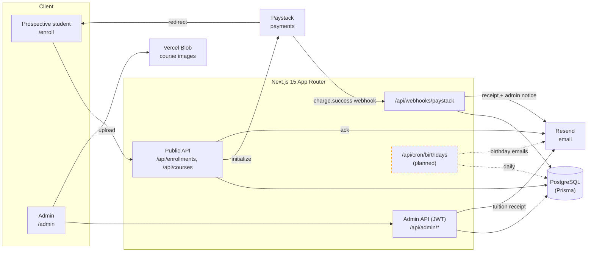
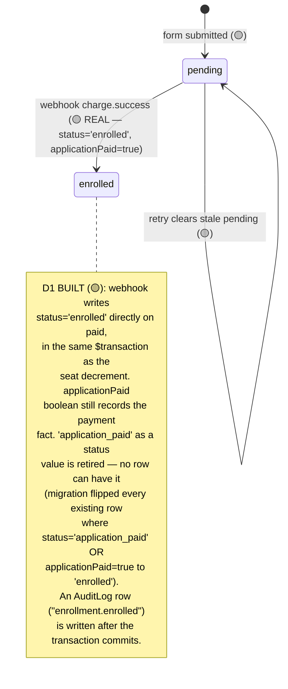
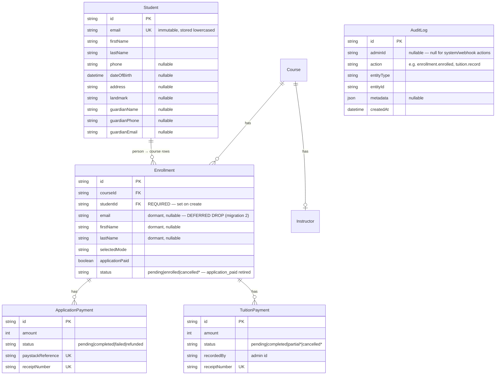
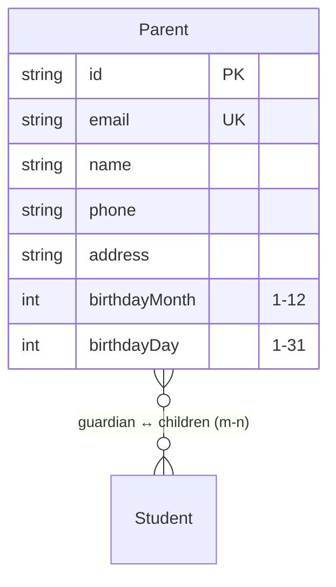

# Banafix — System Blueprint

> **The one document a developer, a designer, and a stakeholder can argue from with the same facts.**
> Every claim is marked with its source so you know how much to trust it.

| Marker | Means | Source |
| --- | --- | --- |
| 🟢 LIVE | Observed on a running system | captured response, real log, DB query |
| 🟡 CODE | Read from source | controller, Prisma schema, enum |
| 🔵 INTENT | Planned, not built | this conversation's requirements |
| ⚠️ UNVERIFIED | Could not be checked | reason stated inline |

- **Mode:** `sync` (current flow re-derived from source) + `init` (the 4 planned additions, all 🔵 INTENT)
- **Date:** 2026-08-31 · **Branch:** `foundation-student-entity` @ `3dd52b4` · **Stack:** Next.js 15 (App Router) · Prisma/Postgres · Paystack · Resend · Vercel Blob

---

## 1. Status snapshot

| Area | State | Notes |
| --- | --- | --- |
| Course browsing + enrollment form | 🟢 Live | `/enroll`, course APIs |
| Application-fee payment (Paystack) | 🟡 Code | init → redirect → webhook verify; webhook signature path proven 🟢 |
| `Student` entity (canonical person, unique immutable lowercased email) | 🟡 Code | **D2 built.** `prisma/schema.prisma` `model Student`; `Enrollment.studentId` FK; staged migration backfilled one `Student` per `lower(email)` (most-recent-wins) — see §4, §5 |
| Enrollment status → `enrolled` | 🟡 Code | **D1 built.** Webhook now writes `status='enrolled'` directly on paid (no `application_paid` status value); existing rows backfilled by the migration — see §4, Drift §9 |
| Admin activity/audit log | 🟡 Code | **Built, not yet exposed in UI.** `AuditLog` model + `logAdminAction()` (`lib/audit.ts`), best-effort (never throws); wired into the webhook (`enrollment.enrolled`) and tuition recording (`tuition.record`) |
| Student "application received" ack email | 🟡 Code | `POST /api/enrollments` |
| Student paid-receipt + PDF (application fee) | 🟡 Code | webhook, now sourced from `enrollment.student.*` |
| Admin "new paid enrollment" notice | 🟡 Code | webhook → `ADMIN_EMAIL`/`SUPPORT_EMAIL` |
| **Email delivery (all of the above)** | ⚠️ **Blocked** | `RESEND_API_KEY` is a placeholder (401); `banafix.com` sender domain unverified — **unchanged by this shipment** |
| Tuition payment (admin-recorded) + student receipt | 🟡 Code | `POST /api/admin/enrollments/[id]/tuition`; receipt now sourced from `enrollment.student.*`; each record writes an `AuditLog` row |
| Migration 2 — drop dormant `Enrollment` identity columns | ❌ **Deferred** | `email`/`firstName`/`lastName`/`phone`/`dateOfBirth`/`address`/`landmark`/`guardianName`/`guardianPhone`/`guardianEmail` on `Enrollment` are nullable and unread by app code, but still present in the DB and `schema.prisma` — dropping them is a separate follow-up PR, after prod verification of migration 1 |
| Tuition: admin copy of receipt | 🟡 Code | **req #1 built** — separate best-effort send to `ADMIN_EMAIL` in `sendTuitionReceipt` |
| Tuition: full/part marking + balance | 🟡 Code | **req #1 built** — Full/Part marker; balance = `course.pricing[mode] − totalPaid` on receipt/modal/table |
| Edit student record (admin) | 🟡 Code | **req #2 built** — `PATCH /api/admin/students/[id]` (email immutable) + edit modal + `student.update` audit; O4 reconciled (re-enroll no longer overwrites edits) |
| Parent records + parent↔child mapping | 🟡 Code | **req #3 built** — `Parent` model + m-n `_ParentChildren` to `Student`; `/admin/parents` CRUD + child picker; `parent.*` audit |
| Birthday automation (students + parents) | 🟡 Code | **req #4 built** — Vercel Cron → `/api/cron/birthdays` (CRON_SECRET); `BirthdayEmailLog` dedup; delivery pending real `RESEND_API_KEY` |

---

## 2. System map 🟡



---

## 3. End-to-end workflow — enrollment → payment → follow-up 🟡

```mermaid
sequenceDiagram
    actor S as Student
    participant FE as /enroll (browser)
    participant API as POST /api/enrollments
    participant PS as Paystack
    participant WH as Webhook
    participant DB as Postgres
    participant M as Resend
    actor A as Admin

    S->>FE: Fill enrollment form
    FE->>API: submit (courseId, mode, student info)
    API->>DB: upsert Student (by lower(email); refresh mutable fields)
    API->>DB: create Enrollment (studentId, status=pending)
    API->>DB: create ApplicationPayment (pending)
    API->>PS: initialize (location-based fee)
    API->>M: "application received" ack (best-effort)
    API-->>FE: authorization_url
    FE->>PS: redirect to checkout
    S->>PS: pay (card/bank/ussd/transfer)

    par Redirect (cosmetic only)
      PS-->>FE: /enroll/success?reference=…
      FE->>API: GET /api/enrollments/verify
      API-->>FE: status (reads DB / asks Paystack)
    and Webhook (authoritative)
      PS->>WH: charge.success
      WH->>PS: verify(reference)
      WH->>DB: ApplicationPayment=completed;<br/>Enrollment.status=enrolled; seatsLeft--
      WH->>DB: AuditLog "enrollment.enrolled"
      WH->>M: student receipt + PDF (from Student)
      WH->>M: admin "new paid enrollment" notice
    end

    Note over A,DB: tuition recording is still admin-manual
    A->>DB: record tuition payment → student receipt + AuditLog "tuition.record"
```

**The critical design rule 🟡:** money and state changes happen **only** in the webhook. The `/enroll/success` redirect is UX-only — it *reads* status, never *writes* it. This makes a closed Paystack tab harmless and makes replayed webhooks safe (an already-`completed` payment early-returns — idempotent).

---

## 4. Enrollment status state machine

**Current (🟡) — D1 built, real code path:**



> **Decision D1 (resolved + built):** paying the registration fee **is** enrollment — no approval gate. The webhook sets `status = 'enrolled'` (and `applicationPaid = true`) inside `app/api/webhooks/paystack/route.ts`'s `$transaction`; the redundant `application_paid` status value is retired and existing rows were backfilled to `enrolled` by the migration. `cancelled` remains available but is out of scope until a cancel action exists. The registration fee is **non-refundable** (some students may never start) — tracked as a note, not a status; tracking "actually started lessons" is a possible future flag, not part of this.
>
> **Known limitation:** the `enrolled`/audit/receipt DB path was verified via scratch-DB assertions + `tsc`/build, but was **not exercised against a live Paystack test-mode charge** — the local webhook harness uses a fabricated reference that fails Paystack's own verify step before this code runs. See `docs/sop/student-entity-foundation.md` for detail.

---

## 5. Data model

### 5.1 Current (relevant tables) 🟡



**Field traps 🟡**
- `Student.email` is now the **unique, immutable, lowercased** identity key — a person enrolling in two courses is one `Student` with two `Enrollment` rows. Built via `Student.upsert({ where: { email: normalizedEmail } })` in `POST /api/enrollments`; mutable fields (name/phone/DOB/address/guardian info) **refresh on every re-enroll** (O4) — the most recent enrollment submission wins as the student's current record.
- `Enrollment.email`/`firstName`/`lastName`/`phone`/`dateOfBirth`/`address`/`landmark`/`guardianName`/`guardianPhone`/`guardianEmail` are **dormant**: nullable, unread by any app code (all cut over to `enrollment.student.*`), but still present in the DB and `schema.prisma`. Dropping them is **migration 2 — deferred**, a separate follow-up PR after prod verification of migration 1.
- `Enrollment.status` no longer has an `application_paid` value in practice — the migration flipped every row where `status='application_paid' OR applicationPaid=true` to `enrolled`, and no code path writes `application_paid` anymore. The column itself still accepts any string (no DB-level enum/check constraint).
- `TuitionPayment.status` allows `partial`, and `TuitionReceiptData` already carries an optional `remainingBalance`, but the route **hardcodes `completed`** and never sets a balance. The capability is modelled, not wired.
- No field anywhere stores the **expected total tuition** — so "balance remaining" has no current source of truth (§8, D3).

### 5.2 Planned additions 🔵 (proposed — subject to §8 decisions)



> `Student` and `AuditLog` moved from planned to 🟡 CODE this shipment (D1/D2 built — see §4, §7 NB). `Parent` (req #3) is now unblocked by the `Student` entity and remains the only planned addition to the data model.

---

## 6. Endpoint index

| Method | Path | Auth | Purpose | Prov |
| --- | --- | --- | --- | --- |
| POST | `/api/enrollments` | public | Create enrollment + init payment + ack email | 🟡 |
| GET | `/api/enrollments` | public* | List enrollments (admin page uses it) | 🟡 |
| GET | `/api/enrollments/[id]` | public* | Enrollment detail | 🟡 |
| GET | `/api/enrollments/verify` | public | Confirm payment for success page | 🟡 |
| POST | `/api/webhooks/paystack` | signature | `charge.success` → `status='enrolled'` + audit + emails | 🟢 sig / 🟡 rest (enrolled/audit write not live-verified — see §4) |
| POST | `/api/admin/enrollments/[id]/tuition` | JWT | Record tuition + student receipt + `AuditLog` | 🟡 |
| GET | `/api/admin/enrollments/[id]/tuition` | JWT | List tuition payments | 🟡 |
| GET/POST | `/api/admin/tuition-payments/[id]/receipt` | JWT | Regenerate/resend tuition receipt (from `student.*`) | 🟡 |
| GET | `/api/receipts/application-fee/[id]` | JWT | Regenerate/resend application receipt (from `student.*`) | 🟡 |
| — | **`PATCH /api/admin/enrollments/[id]`** | JWT | **Edit student record (email immutable)** | 🔵 req #2 |
| — | **`/api/admin/parents` (CRUD)** | JWT | **Manage parents + child mapping** | 🔵 req #3 |
| — | **`GET /api/cron/birthdays`** | `CRON_SECRET` | **Daily birthday emails** | 🔵 req #4 |

\* Public read endpoints for enrollment detail/list are currently unauthenticated — flagged as a hardening follow-up (§8, D5).

---

## 7. Planned additions — design detail 🔵

### Req #1 — Tuition receipt to admin + full/part payment + balance
- **Already done 🟡:** student receipt + PDF is sent when a tuition payment is recorded (`sendTuitionReceipt`).
- **To add:**
  - **Admin copy** of every tuition receipt (to `ADMIN_EMAIL`/`SUPPORT_EMAIL`).
  - **Full vs partial** marker per payment: admin picks `full` or `partial`; store on `TuitionPayment.status` (`completed` vs `partial`).
  - **Balance remaining:** `expectedTotal − Σ(completed+partial payments)`. Show on the receipt and admin table. **`expectedTotal` source is decided (D3): `course.pricing[selectedMode]`** — not yet built.

### Req #2 — Edit student record (admin)
- New `PATCH /api/admin/enrollments/[id]` (JWT), operating on the now-real `Student` entity. Editable: names, phone, DOB, address, guardian info, preferences, notes.
- **`email` is immutable** — rejected/ignored server-side even if sent (matches how `Student.email` already behaves in the enrollment-create flow, §5).
- Admin UI: an edit form on the enrollment detail/row. Every edit writes an `AuditLog` entry (using the now-built `logAdminAction()`, §7 NB).
- **Must reconcile with O4** (refresh-on-reenroll, built in this shipment — a re-enrollment silently overwrites the student's mutable fields with whatever the new enrollment form submitted). Once this module lands, decide whether admin edits should be sticky against a later re-enrollment overwrite, or whether re-enrollment should stop refreshing fields once an admin has edited the record. Open design question for whoever builds req #2.

### Req #3 — Parent records + child mapping
- New `Parent` model (name, email, phone, address, birthday **month + day only**).
- **Many-to-many** parent ↔ children (a parent can have multiple children; a child could have multiple guardians).
- Admin can create a parent and attach one or more **existing enrolled students** as children.
- **Unblocked** — D2 is built; `Student` is the real target of the m-n relation, not a design placeholder.

### Req #4 — Birthday automation (students + parents)
- Daily scheduled job (**Vercel Cron** recommended — `vercel.json` + `GET /api/cron/birthdays` guarded by `CRON_SECRET`).
- Finds students (full DOB) and parents (month+day) whose birthday is **today in Africa/Lagos**, sends a professional templated message.
- **Dedup** so nobody gets two emails — now solved by construction: `Student.email` is unique, so a `Student` query naturally returns each person once regardless of how many `Enrollment` rows they have.

### NB — Admin activity/audit log — 🟡 BUILT (foundation)
- `AuditLog` model + `logAdminAction(entry)` (`lib/audit.ts`) shipped in this milestone — best-effort (try/catch, never throws, so a logging failure can't break the calling request).
- **Wired today:** webhook enrollment-paid (`action: 'enrollment.enrolled'`) and admin tuition recording (`action: 'tuition.record'`). Student-edit and parent-CRUD actions will add their own `logAdminAction()` calls when those modules (req #2/#3) are built.
- **Not exposed in the UI yet** — recorded now, surfaced later.

---

## 8. Open questions / decisions needed

| # | Decision | Status | Resolution |
| --- | --- | --- | --- |
| **D1** | What should `enrolled` mean, given nothing sets it today? | ✅ **DECIDED + BUILT** | Paying **is** enrollment (no gate). Webhook sets `status='enrolled'`; `application_paid` status value retired + all existing rows backfilled. Fee non-refundable. |
| **D2** | What is a "student" for parent-mapping + birthdays? | ✅ **DECIDED + BUILT** | `Student` (person) entity keyed by unique immutable lowercased email; `Enrollment.studentId` FK references it; migration backfilled one `Student` per `lower(email)` (most-recent-enrollment-wins). Migration 2 (dropping the now-dormant `Enrollment` identity columns) is deferred to a follow-up PR. |
| **D3** | Source of "expected total tuition" for the balance? | ✅ **Decided (build pending)** | `expectedTotal = course.pricing[selectedMode]`. Not yet built — consumed by the future tuition-balance module (req #1, §7). |
| **D4** | Birthday scheduler mechanism? | ✅ **DECIDED** | Vercel Cron (`vercel.json` + guarded `/api/cron/birthdays`). |
| **D5** | Public enrollment read endpoints are unauthenticated. | ⏳ **OPEN** | Harden `GET /api/enrollments[ /[id]]` behind admin auth — follow-up pass. |

---

## 9. Drift detection

| Claim | Where stated | Reality (source) | Verdict |
| --- | --- | --- | --- |
| "Once the application fee is paid, the student is **enrolled**, automated." | user's mental model | Webhook now writes `status='enrolled'` in the paid `$transaction`, read in `app/api/webhooks/paystack/route.ts` 🟡 | ✅ **now true** — was drift as of the last sync, resolved this shipment |
| Tuition receipt goes to the student | assumed "not sure if handled" | `sendTuitionReceipt` **is** called on record 🟡 | ✅ already done |
| Tuition supports partial payments | schema comment `partial` | route hardcodes `completed`, balance never set 🟡 | ⚠️ modelled, not wired |
| Enrollment emails are sent | SOP `enrollment-emails.md` | code sends 🟡 but `RESEND_API_KEY` is a placeholder → 401 🟢 | ⚠️ wired, **not delivering** — unrelated pre-existing blocker, unchanged by this shipment |
| Admin status dropdown changes status | reasonable assumption | it's bound to `statusFilter` — a **filter**, not a setter 🟡 | ❌ no status write |
| The `enrolled`/audit-log DB write path is proven working | task ledger self-review | verified via scratch-DB assertions (migration) + `tsc`/`build` (webhook code) + manual review — **not** via a live Paystack test-mode charge (local harness's fabricated reference fails Paystack verify before this code runs) 🟡 CODE / ⚠️ UNVERIFIED live | ⚠️ **honest gap** — believed correct, not proven end-to-end |

---

## 10. Verification table

| Behaviour | How checked | Provenance |
| --- | --- | --- |
| Webhook accepts valid signature (200), rejects forged (400) | ran `npm run test:webhook` against live dev server | 🟢 LIVE |
| Webhook stops before emails/status-write on unverifiable reference | dev-server log: event routed, no email step | 🟢 LIVE |
| Enrollment create → `Student` upsert → pending Enrollment → Paystack init | read `app/api/enrollments/route.ts` | 🟡 CODE |
| One `Student` per `lower(email)`, most-recent-wins backfill, no orphaned enrollments, no row loss | scratch-DB Docker Postgres, brief's 6 assert queries all passed (see `task-1-report.md`) | 🟢 LIVE (scratch DB) |
| Existing `application_paid`/`applicationPaid=true` rows flipped to `status='enrolled'` | scratch-DB assertion (`still_appic = 0`, sample row `status = enrolled`) | 🟢 LIVE (scratch DB) |
| Webhook sets `status='enrolled'` + writes `AuditLog` + decrements seats | `tsc --noEmit` (0 errors) + manual read of `app/api/webhooks/paystack/route.ts`; **not exercised by a live Paystack charge** | 🟡 CODE / ⚠️ UNVERIFIED live |
| Receipt/admin-notice emails read `enrollment.student.*` correctly at runtime | `tsc --noEmit` + review; **not exercised live** (same gap as above) | 🟡 CODE / ⚠️ UNVERIFIED live |
| Student/admin/receipt emails render + send | send functions read; **delivery blocked on Resend key** (pre-existing, unrelated) | 🟡 CODE / ⚠️ UNVERIFIED |
| Whole-repo type safety after cutover | `npx tsc --noEmit` → 0 errors | 🟢 LIVE |
| Production build succeeds after cutover | `npm run build` → success, 35/35 static pages | 🟢 LIVE |
| Migration 2 (drop dormant `Enrollment` identity columns) | not built | 🔵 INTENT (deferred, separate PR) |
| 3 remaining planned additions (tuition balance, parent mapping, birthdays) | not built | 🔵 INTENT |

---

## 11. What is NOT built (so a diagram is not mistaken for a shipped feature)

- Migration 2 — dropping the dormant `Enrollment` identity columns (deferred, separate follow-up PR).
- Live (Paystack test-mode charge) verification of the `enrolled`/audit/receipt DB write path — verified only via scratch-DB assertions + `tsc`/build + review, not a real charge round-trip.
- Tuition admin-copy, full/part marking, balance.
- Editing a student record (req #2) — and its interaction with O4 refresh-on-reenroll is an open design question, not yet resolved.
- Parent records and parent↔child mapping (req #3) — unblocked by the `Student` entity, not yet built.
- Birthday automation + any scheduler/cron (req #4).
- Authenticated/hardened enrollment read endpoints.
- **Actual email delivery** (blocked on a real `RESEND_API_KEY` + verified sender domain — pre-existing, unrelated to this shipment, not fixed by it).

---

_Authoritative source: this file. The published Artifact and the checklist (`docs/checklist/`) are regenerated from it — edit here first._
